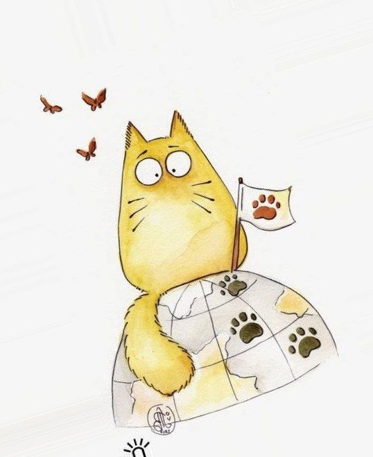

# Elza Loresh

## Contact with me:
* Skype: 
* Gmail: 
* Phone: +7(909) 330 XX XX

## Summary
> I'm an enthusiastic, responsible and hard working IT person. Being worked for different projects helped me to adopt to the changes 
> quickly and made me a mature team worker. I am able to work well both in a team environment as well as using own initiative.

## Skills:
* HTML
* CSS
* JS
* Git
* VS Code
* Bake a cake

## Code examples
<code>
<!DOCTYPE html>
<html lang="en">
<head>
    <meta charset="UTF-8">
    <title>Hello world</title>
</head>
<body>
    <h1>Hello world</h1>
</body>
</html>
</code>

## Experience
Junior developer, Nov 2018 - Sep 2019 | *Web site for goverments* 

## Education
Name of course | Link
------------ | -------------
html academy | [See my achievements](https://htmlacademy.ru/profile/id1052883/achievements)
codecademy | [See my achievements](https://www.codecademy.com/users/blogMaster41128/achievements)
нетология "Основы html и css" | [Info about course](https://netology.ru/programs/html-css-base#/presentation)
udemy | [See my certificate](https://www.udemy.com/certificate/UC-BAB7015Y/?utm_campaign=email&utm_source=sendgrid.com&utm_medium=email)

## English 
> My English level is A2.
> I like to listen English songs. I watched serial - "Extra English". I learned English in online school "Puzzle English". 
> I watched IT-courses in English sometimes. 